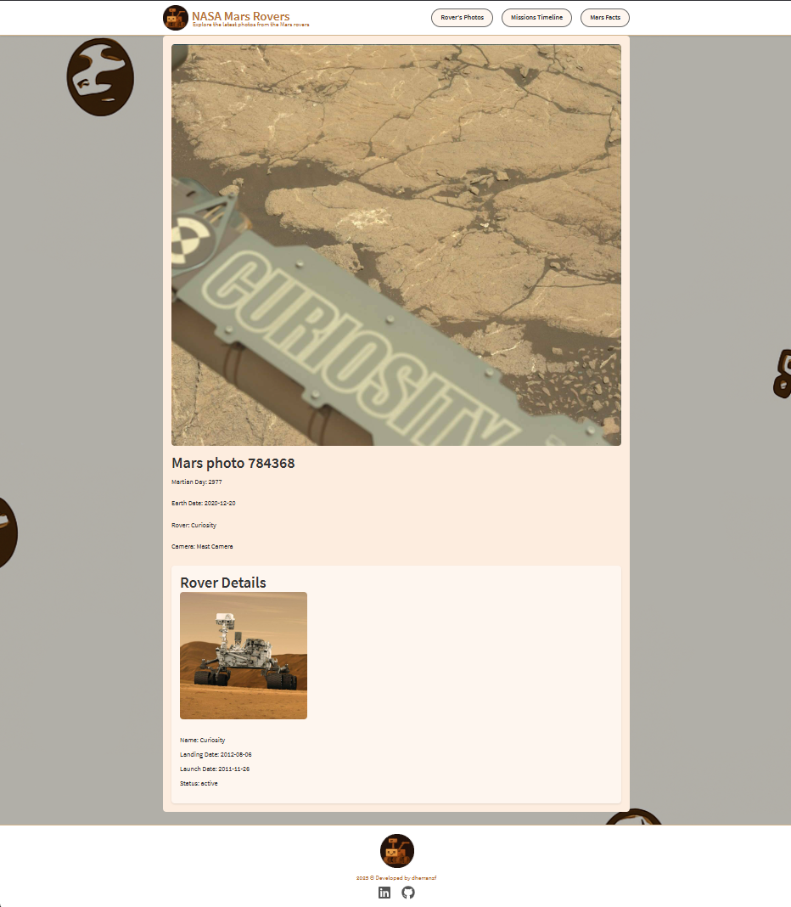

# 🪐🛰️ NASA Mars Rovers GraphQL Client

A **React** front-end application built with **TypeScript** and **GraphQL Client**, designed to interact with the **NASA Mars Rovers GraphQL Server**. This client leverages modern web technologies for exploring photos taken by NASA's Mars Rovers, and other information of Mars. It features a visually appealing and responsive interface.

Explore the wonders of Mars with this GraphQL React Web! 🔭

## 📑 Table of Contents
- [🧑‍💻 Features](#-features)
- [🎨 Technology Stack](#️-technology-stack)
- [🗂️ Project Structure](#-project-structure)
- [📖 How to Use This Repo](#-how-to-use-this-repo)
- [🔍 Example Screenshots](#-example-screenshots)
- [🔮 Future Improvements](#-future-improvements)
- [📜 License](#-license)

## 🧑‍💻 Features
- Display a grid of Mars Rover photos and Filter photos by Martian Sol or Earth Date.
- View detailed information about a specific photo, including the rover and camera details.
- Increment the view count for a photo when it is clicked.
- Explore a timeline of Mars Rover missions.
- Learn interesting facts about Mars in the "Mars Facts" section.
- Responsive design for seamless use on desktop and mobile devices.

## 🎨 Technology Stack

### Key Technologies
| Technology       | Purpose                                                                 | Advantages                                                                 |
|------------------|-------------------------------------------------------------------------|----------------------------------------------------------------------------|
| **React**        | Provides a component-based architecture for building the UI.           | Reusable components, fast rendering with Virtual DOM, and a large ecosystem. |
| **Apollo Client**| Handles GraphQL queries and mutations.                                 | Simplifies data fetching, caching, and state management for GraphQL APIs. |
| **TypeScript**   | Ensures type safety and better developer experience.                   | Reduces runtime errors, improves code readability, and provides autocompletion. |
| **Emotion**      | Enables CSS-in-JS styling for components.                              | Scoped styles, dynamic theming, and better maintainability of styles.     |
| **Vite**         | A fast build tool for modern web applications.                         | Lightning-fast development server, optimized builds, and modern JavaScript support. |

### Design Practices
- **API First / Schema First**: The GraphQL schema is defined first, serving as the contract for the API and ensuring consistency between the client and server. This also enables parallel development between client and server.
- **Component-Based Architecture**: The UI is built using reusable React components, making the codebase modular and easier to maintain.
- **GraphQL Integration**: Apollo Client is used to fetch data from the GraphQL server, providing a seamless and efficient way to interact with the API.
- **Type-Safe Development**: TypeScript ensures that the code is robust and less prone to bugs, improving developer productivity.
- **Responsive Design**: The application is styled to work seamlessly on devices of all sizes, ensuring a great user experience.
- **Testing**: Unit and integration tests have been implemented using `vitest` and `@testing-library/react` to ensure the reliability and correctness of the application.

## 🗂️ Project Structure

The project is organized as follows:

```
src/
├── components/          # Reusable UI components
├── containers/          # Components with logic tied to specific data
├── pages/               # Page-level components
├── utils/               # Utility functions and hooks
├── styles.tsx           # Global styles and theme definitions
├── __generated__/       # Auto-generated GraphQL types and queries
└── index.tsx            # Entry point for the application
```

### Key Files
- **`src/components/`**: Contains reusable UI components like headers, footers, and layout components.
- **`src/containers/`**: Includes components tied to specific data, such as `marsphoto-card.tsx`.
- **`src/pages/`**: Page-level components representing different routes, e.g., `marsphotos.tsx` and `marsphoto.tsx`.
- **`src/utils/`**: Utility functions and custom hooks, such as `helpers.ts` and `useWindowDimensions.ts`.
- **`src/styles.tsx`**: Defines global styles and theme variables for the application.
- **`src/__generated__/`**: Auto-generated files like TypeScript types and GraphQL queries.
- **`src/index.tsx`**: Entry point for the application, initializing React and Apollo Client.

## 📖 How to Use This Repo

Follow these steps to set up and run the client:

### ⚙️ Setup

1. Navigate to the `client` folder:
   ```sh
   cd client
   ```
2. Install dependencies:
   ```sh
   npm install
   ```

### 🚀 Running the Client

Run the client:
   ```sh
   npm start
   ```

This will launch the client application, ready to interact with the GraphQL server. 🌐

### 🧪 Running Tests

Run the tests using the following command:
   ```bash
   npm test
   ```

This will execute all test cases, including unit and integration tests, and display the results in the terminal.

## 🔍 Example Screenshots

### Home - Mars Photos Grid


### Page Photo Details


### Page Rover Missions Timeline


### Page Martian Facts


## 🔮 Future Improvements
- Add more filtering and sorting options for photos.
- Implement infinite scrolling for the photo grid.
- Add user authentication for personalized features.
- Improve error handling and user feedback.

## 📜 License

This project is licensed under the MIT License. See the `LICENSE` file for details.
